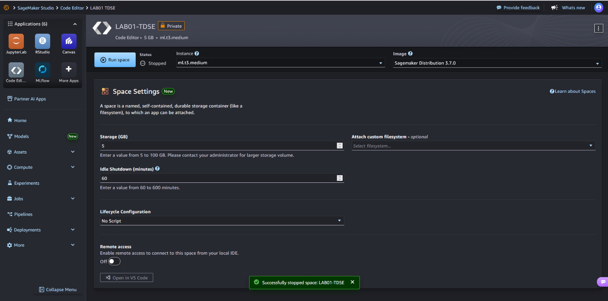
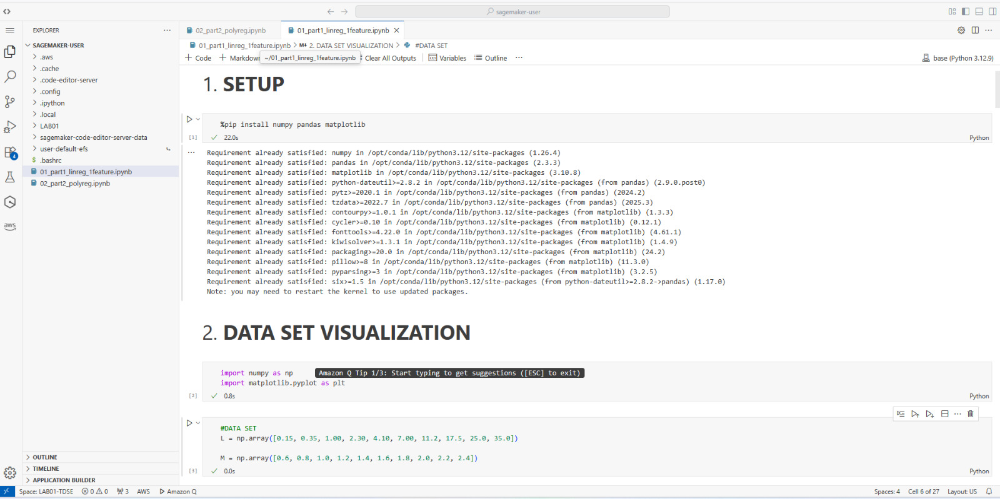
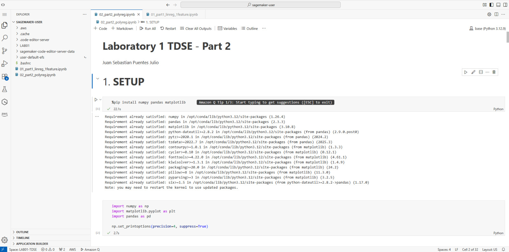
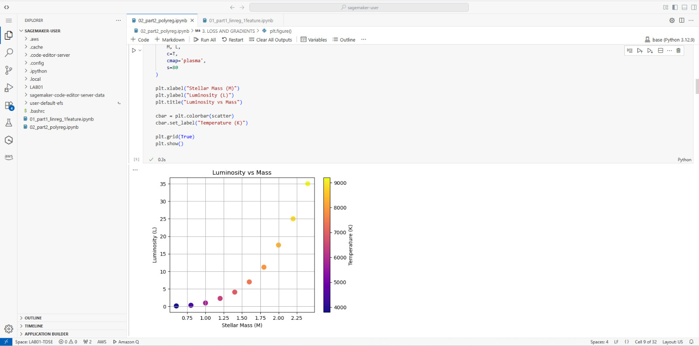

# Linear and Polynomial Models for Regression - Laboratory 1 TDSE

This laboratory explores the relationship between Stellar Mass and Luminosity using Linear and Polynomial regression models. It is divided into two parts: a simple linear regression model and a more complex polynomial regression model incorporating temperature and interaction terms, implementing cost functions and gradient descent algorithms.

## Getting Started

### Prerequisites

You need Python 3.x and the following libraries installed:

* numpy
* matplotlib

### Installing

To get the development environment running:

1. Clone this repository to your local machine.
2. Open the project folder in your preferred editor.
3. Create a virtual environment.

## Running the Analysis

Open the Jupyter notebooks to view the analysis and run the models:

*   **01_part1_linreg_1feature.ipynb**: Contains the Linear Regression analysis for Stellar Mass vs Luminosity.
*   **02_part2_polyreg.ipynb**: Contains the Polynomial Regression analysis including Design Matrix and additional features.

Execute the cells sequentially to visualize data and observe the predictions.

## AWS SageMaker Execution Evidence

To upload the notebooks to SageMaker, first log in to AWS Academy, start the lab, and create an environment following the step-by-step instructions on the right. Once created, click on the "Open Studio" option. Then, select the option to create a Code Editor and click "Run Space". Once opened, drag the files to the editor and they will open automatically.

Comparing both editors, from my point of view Sagemaker runs the notebooks a little faster than Visual Studio Code. In other respects, it takes me the same time.

## Built With

* [Python](https://www.python.org/) - The programming language used
* [Jupyter](https://jupyter.org/) - Interactive Computing
* [Numpy](https://numpy.org/) - Scientific Computing
* [Matplotlib](https://matplotlib.org/) - Data Visualization

## Authors

* **Juan Sebastian Puentes Julio** - *Laboratory 1 TDSE*

## Acknowledgments

* Professor Jupyter Notebooks that includes information of linear regression.

